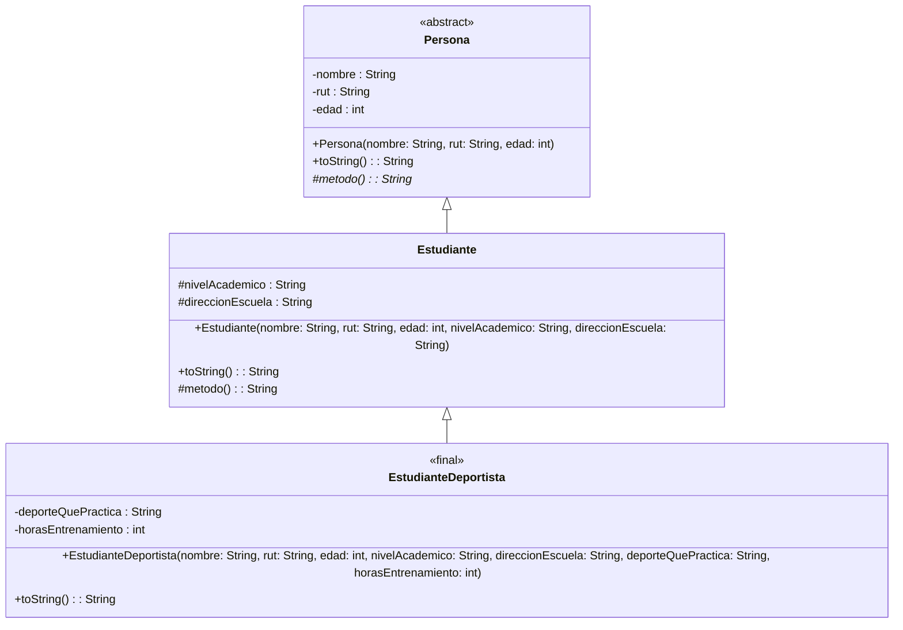

# Diagrama de Clases UML - Actividad de Herencia

A continuación se presenta el diagrama de clases modelado utilizando **Mermaid** (que puedes replicar exactamente igual en la herramienta **Visual Paradigm** o VP como se solicitó).

## Detalles Minuciosos a considerar en Visual Paradigm (VP)

Al transcribir este modelo a **Visual Paradigm**, asegúrate de aplicar las siguientes configuraciones para cumplir con todos los requerimientos de la consigna:

1. **Clase `Persona`**:
   - En las propiedades de la clase, marca el modificador como **abstract** (esto pondrá el nombre en cursiva en VP).
   - Sus atributos `nombre`, `rut` y `edad` deben llevar el símbolo `-` (Visibility = `private`). La indicación dice que la edad es "sólo para ser usado por elementos de tipo Persona", lo cual es la definición por excelencia de un atributo de visibilidad privada.
   - El método `metodo()` debe configurarse con visibilidad **protected** (`#`), y en sus propiedades marcarse como **abstract** (aparecerá en cursiva o con la etiqueta correspondiente, dependiendo de tu configuración visual en VP).
   - Añade la anotación u operación `toString()` (que sobreescribe al de Object).

2. **Clase `Estudiante`**:
   - Dibuja una línea de **Generalization** (herencia) apuntando hacia `Persona`.
   - Añade los atributos `nivelAcademico` y `direccionEscuela` y configúralos con visibilidad **protected** (`#`).
   - Añade las operaciones `toString()` y `metodo()` que indicarán que sobreescriben a las heredadas.

3. **Clase `EstudianteDeportista`**:
   - Dibuja una línea de **Generalization** (herencia) apuntando hacia `Estudiante`.
   - En las propiedades de la clase, establece que es una clase **final** (en VP a veces se representa como un _Stereotype_ `<<final>>` o un tag en propiedades `isLeaf=true`, evitando que pueda ser heredada, ya que es "un caso muy particular").
   - Añade los atributos `deporteQuePractica` y `horasEntrenamiento` y configúralos con visibilidad **private** (`-`).
   - Añade la operación `toString()`.

---

> [!TIP]
> **Relaciones**: Usa el conector de **Generalization** (flecha con punta triangular sin rellenar) desde la clase hija a la clase padre.
> **Visibilidad**: `+` (public), `#` (protected), `-` (private).
